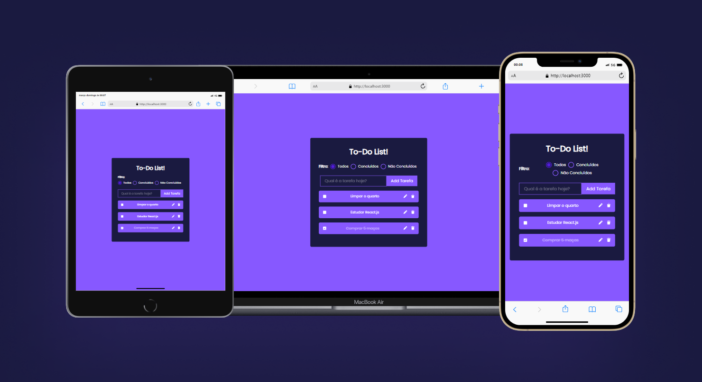
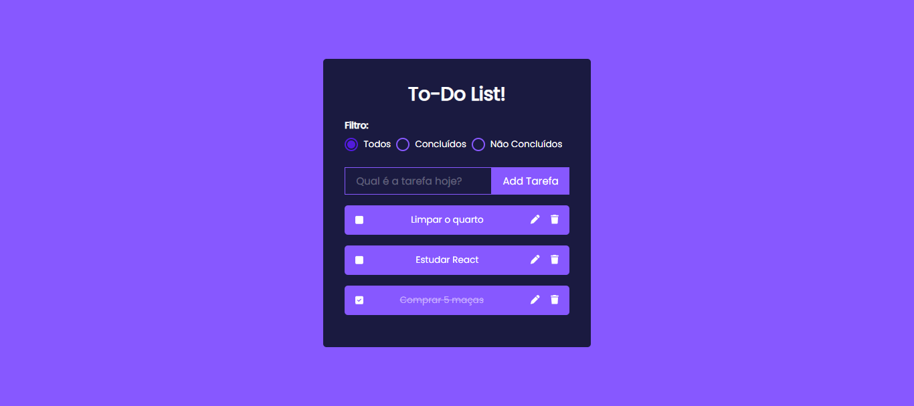
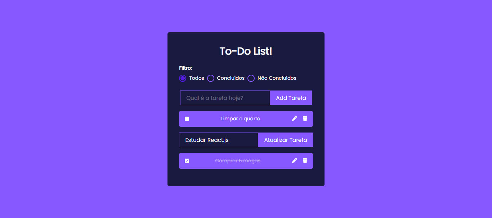
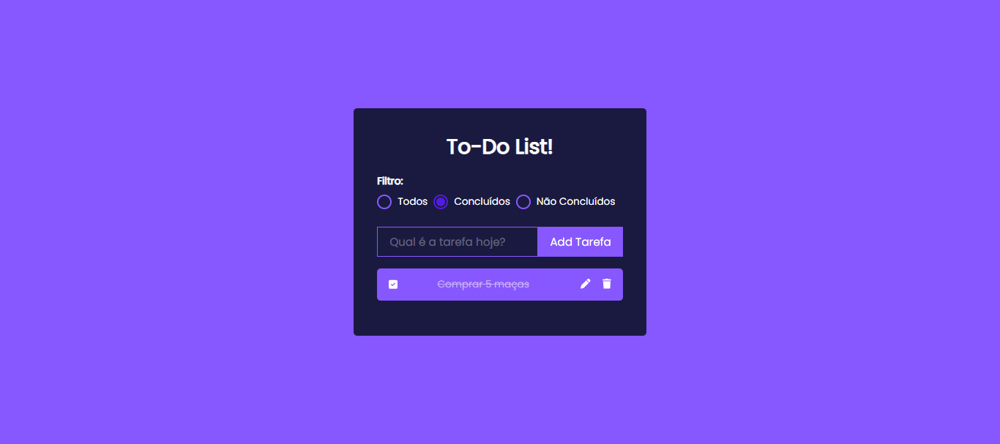
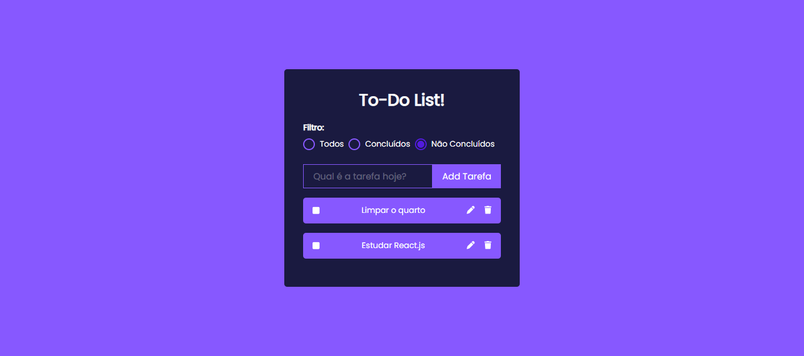

# To-Do List App 📝✨

Este é um projeto de uma aplicação web para uma lista de tarefas (to-do list) desenvolvida em React.js.

## Desafio:

O desafio consistiu em criar uma aplicação web simples que permitisse aos usuários adicionar, marcar como concluídas e excluir tarefas de uma lista. O objetivo era desenvolver uma interface intuitiva e responsiva usando React.js.

## O que foi implementado:

- Desenvolvi uma interface simples e intuitiva para a aplicação.
- Implementei um campo de entrada onde os usuários podem digitar o nome de uma nova tarefa.
- Adicionei um botão para adicionar novas tarefas à lista.
- Cada item na lista de tarefas possui uma opção para marcar a tarefa como concluída.
- Implementei uma funcionalidade para excluir tarefas da lista.
- Garanti que a aplicação fosse responsiva e funcionasse bem em dispositivos móveis.
- Cada vez que uma nova tarefa é adicionada, ela aparece em primeiro na lista.
- Cada vez que uma tarefa é marcada como concluída, ela vai para o fim da lista.
- Implementei a validação para que o usuário não possa adicionar uma tarefa vazia.

## Dificuldades encontradas:

Durante o desenvolvimento deste projeto, enfrentei algumas dificuldades:

1. **Implantação do design para o CSS**: Encontrei dificuldades em traduzir o design esperado para o CSS, especialmente em relação à estilização de componentes e layouts complexos.
2. **Responsividade do To-Do List**: Tive dificuldades em tornar a aplicação responsiva, garantindo que ela se adaptasse adequadamente a diferentes tamanhos de tela e dispositivos móveis.
3. **Implementação de funcionalidades avançadas**: Encontrei desafios ao tentar adicionar funcionalidades avançadas, como edição de tarefas e filtros de exibição. Essas funcionalidades exigiram um maior entendimento e domínio de conceitos avançados do React.js.
4. **Gerenciamento de estado**: No início do desenvolvimento, enfrentei problemas ao lidar com o gerenciamento de estado da aplicação, especialmente ao lidar com a adição e exclusão dinâmica de tarefas. Foi necessário aprender e aplicar técnicas eficazes de gerenciamento de estado para resolver esses problemas.

## Próximos Passos:

Apesar das dificuldades encontradas, estou satisfeito com o resultado geral deste projeto. Para melhorar ainda mais a aplicação, pretendo:

- Aprofundar meu conhecimento em técnicas de CSS e responsividade para melhorar a experiência do usuário em dispositivos móveis.
- Explorar bibliotecas ou frameworks de CSS, como Bootstrap ou Material-UI, para facilitar o desenvolvimento de interfaces responsivas e estilizadas.
- Continuar estudando e praticando o React.js para melhorar minhas habilidades de implementação de funcionalidades avançadas e gerenciamento de estado.

## Imagens do Projeto:

---

Este projeto foi desenvolvido para estudo e aprendizado, onde pude aprimorar meus conhecimentos em React.js e colocar em prática o que aprendi. 🚀
